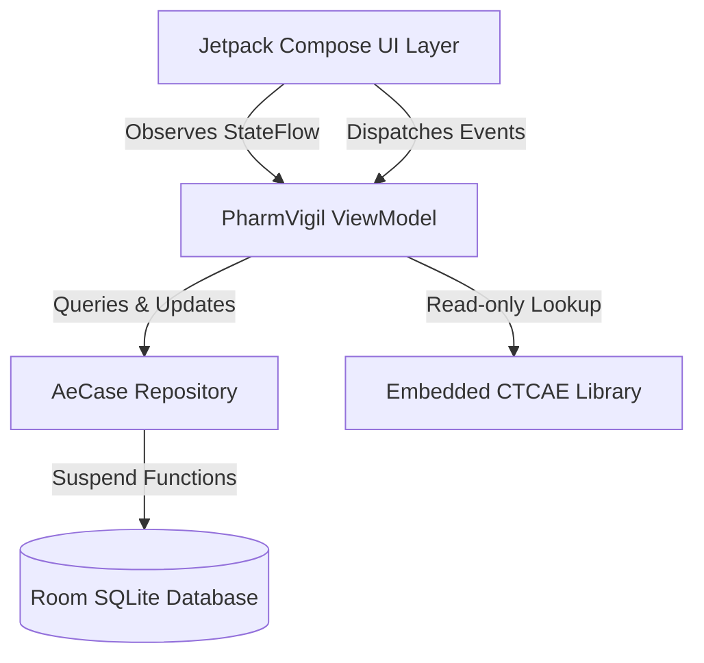
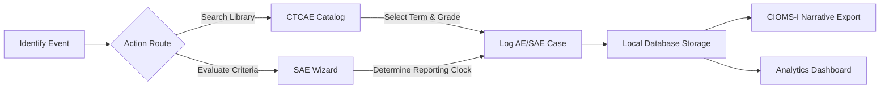

# PharmVigil

PharmVigil is a standalone, offline-first clinical pharmacovigilance application designed for healthcare professionals, clinical trial investigators, and regulatory compliance teams. It facilitates the structured grading, logging, and evaluation of Adverse Events (AE) and Serious Adverse Events (SAE) without requiring active network connectivity or external API dependencies.

## Core Capabilities

*   **CTCAE Reference Library**: An embedded, searchable offline encyclopedia containing common Common Terminology Criteria for Adverse Events (CTCAE) terms, mapped to MedDRA Preferred Terms (PT) and System Organ Classes (SOC).
*   **SAE Regulatory Wizard**: An interactive decision matrix utilizing ICH E2A and FDA 21 CFR 312.32 guidelines. It evaluates seriousness criteria, causality, and expectedness to determine Suspected Unexpected Serious Adverse Reaction (SUSAR) status and calculate expedited regulatory reporting clocks (e.g., 7-day vs 15-day).
*   **Local Data Persistence**: Secure, on-device storage of clinical event logs utilizing Android Room database architecture. Maintains Subject IDs, suspect drugs, clinical narratives, causality assessments, and drug actions.
*   **Automated Narrative Generation**: Formats logged case parameters into standardized CIOMS-I / ICH E2A narrative structures, available for immediate clipboard export.
*   **Analytics Dashboard**: Native visual analytics tracking severity distribution (Grade 1 through Grade 5), seriousness proportions, and critical sentinel event monitoring across active cases.

## System Architecture

The application is built entirely on the Android Jetpack Compose framework, prioritizing a smooth, lag-free user experience through asynchronous data handling and local caching.



## User Flow

The typical clinical workflow within the application is designed for rapid, deterministic data entry at the point of care.



## Technical Implementation

*   **Language**: Kotlin
*   **UI Toolkit**: Jetpack Compose (Material Design 3)
*   **Architecture**: MVVM (Model-View-ViewModel) with Unidirectional Data Flow
*   **Local Storage**: Room Persistence Library (SQLite abstract)
*   **Concurrency**: Kotlin Coroutines & Flow

## Releases & Installation

PharmVigil targets Android 7.0 (API level 24) and higher.

### Prebuilt APK Download
To download a prebuilt Android binary:
* **GitHub Releases**: Download the tagged release assets from the repository's **[Releases](../../releases)** tab.
* **Actions Artifacts**: For the latest development build, go to the repository's **[Actions](../../actions)** tab, select the most recent successful workflow run, and download the `app-debug` build artifact.

### Building From Source
If you prefer to compile the application locally:
```bash
# 1. Clone the repository
git clone https://github.com/arkendrachoudhury-sys/PharmVigil.git
cd PharmVigil

# 2. Build the debug APK using the Gradle Wrapper
./gradlew assembleDebug        # use gradlew.bat on Windows
```

The output APK will be generated at `app/build/outputs/apk/debug/app-debug.apk`. This path only exists locally after a successful build — it is excluded from version control via `.gitignore`, so it will not be present in a fresh clone of the repository.

### Installation Steps
1. Transfer `app-debug.apk` (from a Release, an Actions artifact, or your own build) to your Android device.
2. Tap the APK file in your Android File Manager to install.
3. Enable "Install from Unknown Sources" in Android Security Settings if prompted.
4. Launch **PharmVigil** directly on device with full offline local Room SQLite persistence.
