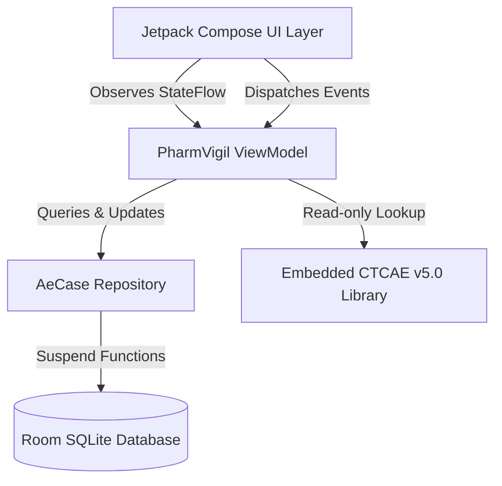

# PharmVigil

PharmVigil is a standalone, offline-first clinical pharmacovigilance and adverse event grading utility designed for healthcare professionals, clinical trial investigators, and regulatory compliance teams. It enables structured grading, logging, editing, and evaluation of Adverse Events (AE) and Serious Adverse Events (SAE) without requiring network connectivity or external API calls.

## Core Capabilities

*   **CTCAE v5.0 Reference Library**: Embedded offline catalog containing high-frequency Common Terminology Criteria for Adverse Events (CTCAE v5.0) terms, mapped to MedDRA Preferred Terms (PT) and System Organ Classes (SOC).
*   **FDA IND SAE Regulatory Decision Support**: Interactive decision aid aligned with FDA 21 CFR 312.32 and ICH E2A guidelines. Evaluates regulatory seriousness criteria, causality, and expectedness against Reference Safety Information (RSI) to determine SUSAR status and expedited reporting clocks (7-day vs 15-day).
*   **On-Device Clinical Persistence**: Local Room SQLite storage for clinical event logs (Subject IDs, suspect drugs, explicit onset dates, clinical outcomes, drug actions, and narrative notes).
*   **Editable Case Management**: Full support for adding, reviewing, editing, and deleting logged cases with mandatory field domain validation and deletion confirmation dialogs.
*   **Automated CIOMS-I Narrative Export**: Formats stored case parameters into standardized CIOMS-I / ICH E2A expedited report narratives for clipboard export.
*   **Synthetic Demo Data**: Opt-in "Load Sample Cases" feature for testing and demonstration without auto-seeding unverified data into clinical logs.
*   **Analytics Dashboard**: Visual summary tracking severity distributions (Grade 1 to 5), seriousness proportions, and critical sentinel events across stored cases.

## System Architecture

PharmVigil is built using modern Android Jetpack Compose architecture and operates completely offline with zero telemetry or network calls.



## Technical Specification

*   **Min Android Version**: Android 7.0 (API Level 24+)
*   **Target Android SDK**: API Level 35 (Android 15)
*   **Language & Toolchain**: Kotlin 2.2.10, Jetpack Compose, KSP 2.3.5, Room 2.7.0
*   **Package Namespace**: `com.pharmvigil.app`
*   **Theme**: `Theme.PharmVigil`
*   **License**: MIT License

## Installation & Releases

### Prebuilt APK Download

Download official prebuilt APK binaries directly from GitHub:
1. Navigate to the **[Releases](../../releases)** page.
2. Select the latest version tag (e.g. `v1.0.0`).
3. Download `PharmVigil-v1.0.0-debug.apk` and verify the SHA-256 checksum from `SHA256SUMS.txt`.
4. Install on your Android device (ensure "Install from Unknown Sources" is enabled in Android Security Settings if prompted).

### Building From Source

```bash
# 1. Clone repository
git clone https://github.com/arkendrachoudhury-sys/PharmVigil.git
cd PharmVigil

# 2. Execute unit tests
./gradlew test

# 3. Build APK
./gradlew assembleDebug
```

Output APK will be generated at `app/build/outputs/apk/debug/app-debug.apk`.

## Regulatory & Clinical Disclaimer

PharmVigil is intended solely as an educational and operational point-of-care decision support utility for clinical pharmacovigilance workflows. CTCAE Grade measures clinical severity, whereas Seriousness is a distinct regulatory threshold under ICH E2A and FDA 21 CFR 312.32. Output generated by this utility does not replace independent medical evaluation by a safety physician, principal investigator, or regulatory sponsor team.
